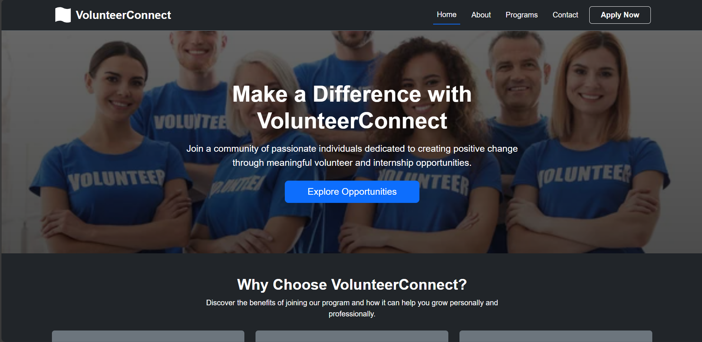
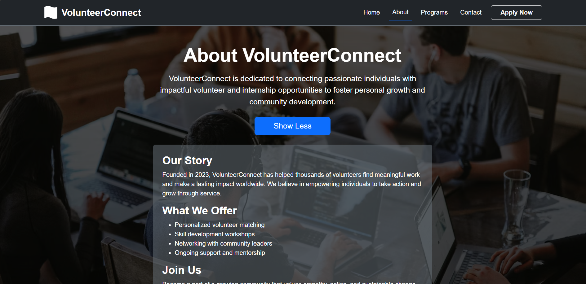
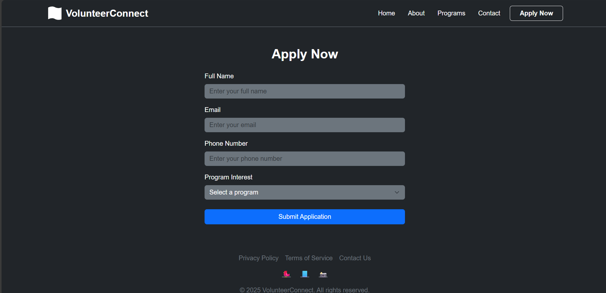
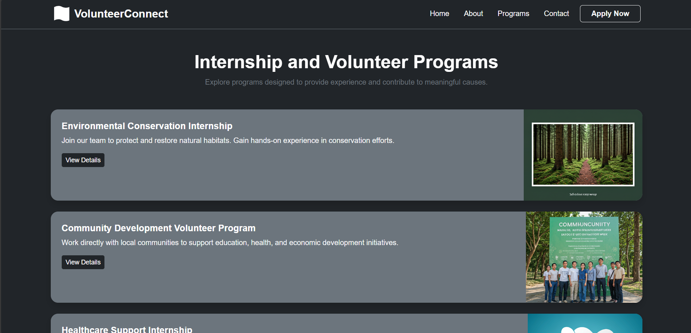
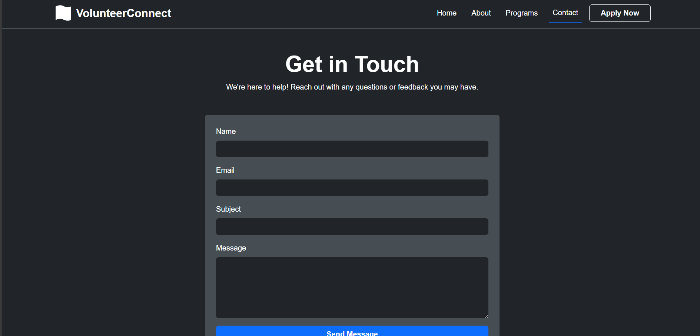
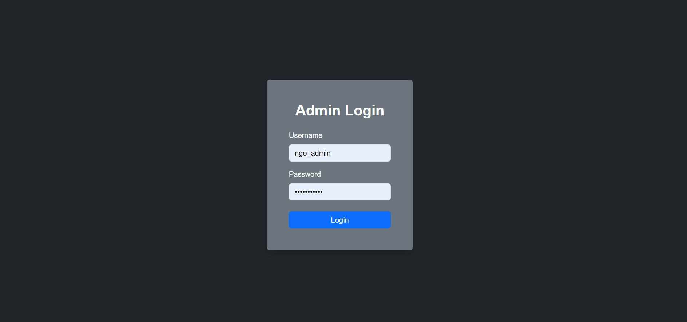
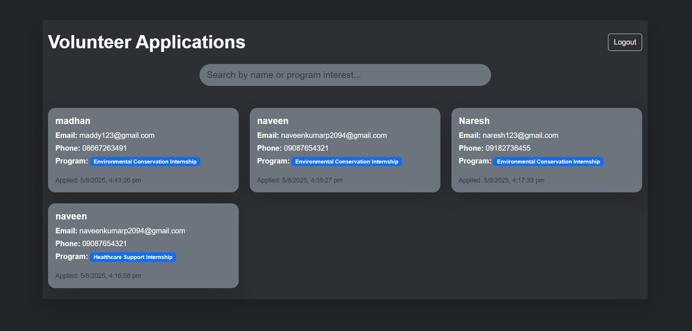
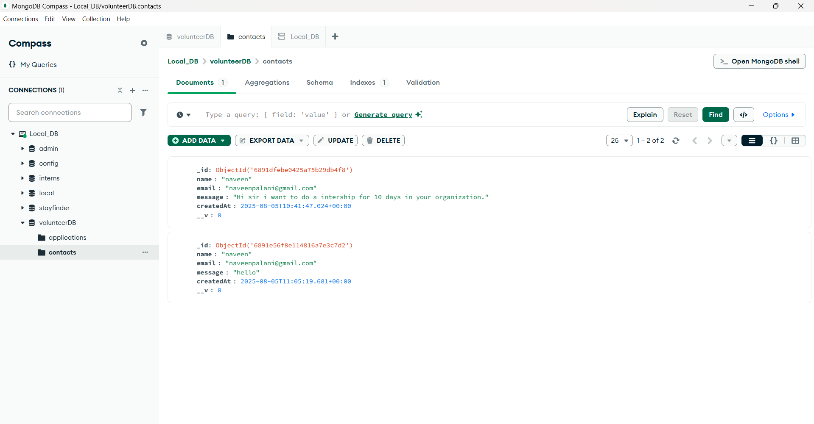

# 🌍 VolunteerConnect

**VolunteerConnect** is a full-stack web application that simplifies volunteer and internship engagement for NGOs. It allows users to explore programs and apply online, while providing a secure admin panel to review all applications.



---

## ✨ Features

- 🎯 Stunning and responsive homepage
- 📝 Easy-to-use application form
- 🔐 Admin login with credential validation
- 🗂️ Admin dashboard to manage applications
- 🔍 Search/filter applicants by name or interest
- 🌙 Full dark theme for a sleek user experience
- 💾 MongoDB for backend data storage

---

## 📸 Screenshots

### 🏠 Home Page


### ℹ️ About Page


### 📋 Apply Form


### 📑 Program Listings


### 📞 Contact Page


### 🔐 Admin Login


### 🧑‍💼 Admin Panel (Dashboard)


### 🗃️ MongoDB Compass View


---

## 🧑‍💼 Admin Credentials

| Username    | Password     |
|-------------|--------------|
| `ngo_admin` | `Welcome@123` |

✅ Visiting `/admin` route will always require admin login.

---

## 🛠️ Tech Stack

| Frontend       | Backend         | Database       |
|----------------|------------------|----------------|
| React.js       | Node.js + Express| MongoDB Atlas / Compass |
| Bootstrap 5    | REST APIs        | Mongoose ODM   |

---

## 📦 Installation & Setup

1. Clone the repo  
   ```bash
   git clone https://github.com/yourusername/stayfinder.git
   cd stayfinder/stayfinder/server

2. Install dependencies

bash
Copy
Edit
npm install

3. Setup .env file in the server folder:

ini
Copy
Edit
PORT=5000
MONGO_URI=your_mongodb_connection_string
JWT_SECRET=your_jwt_secret_key

4. Start the backend server

bash
Copy
Edit
npm run dev

5. Open another terminal and start the frontend (from client folder):

bash
Copy
Edit
cd ../client
npm install
npm start

6. Open http://localhost:3000 to view the app.


### 🤝 Contributing
Feel free to open issues or submit pull requests. Your feedback and contributions are welcome!

### 📄 License
This project is licensed under the MIT License.
